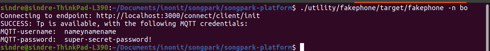

# fakephone

A clojure program that emulates a phone's interaction with the songpark backend. 

## Usage

### General

The client interacts with the backend using URLs. Default URL (endpoint) is:  
`http://localhost:3000/connect/client/init`

Use "-c" flag to specify a different endpoint. Like so:  
`fakephone -c http://blabla:1234/some/other/resource`

Every teleporter has a unique nickname which the client uses to set up a connection. 
Use "-n" flag to specify the tp you wish to connect to. Like so:  
`fakephone -n NICKNAME`

### Request connection to specific TP, and get MQTT credentials

First, create an executable app by running:
`lein bin`
In the project directory

Then, run the following command with your a valid tp nickname  
`./utility/fakephone/target/fakephone -n NICKNAME`

NOTE: You need some valid tp entries in the db to succeed

Example:

